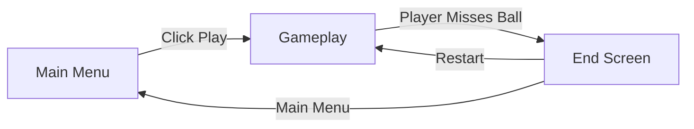
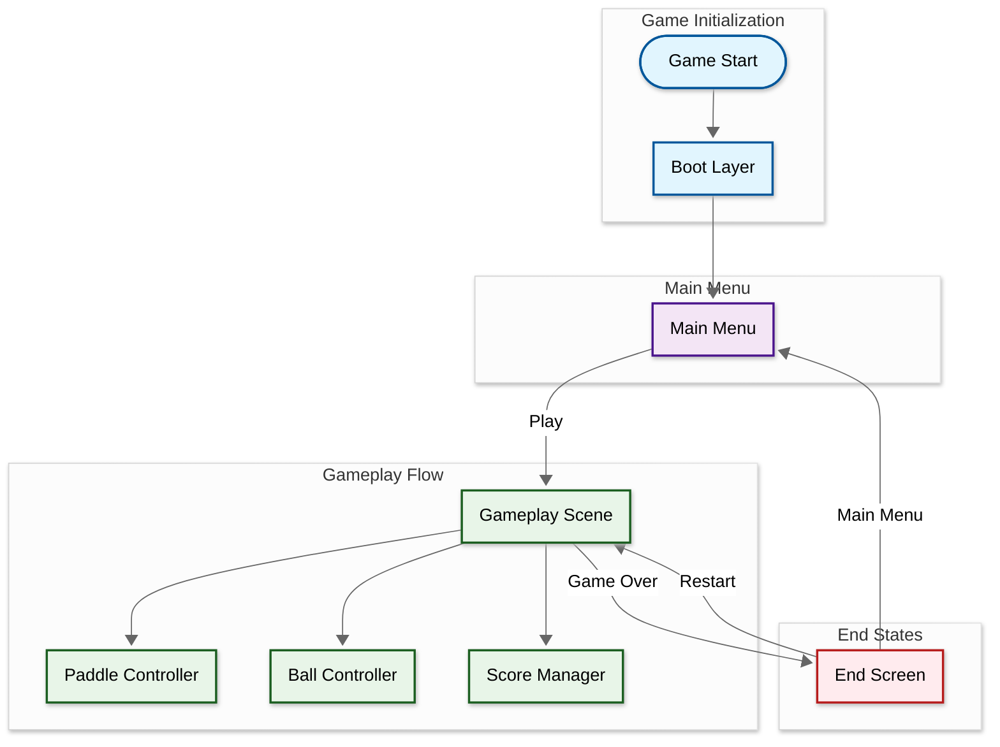
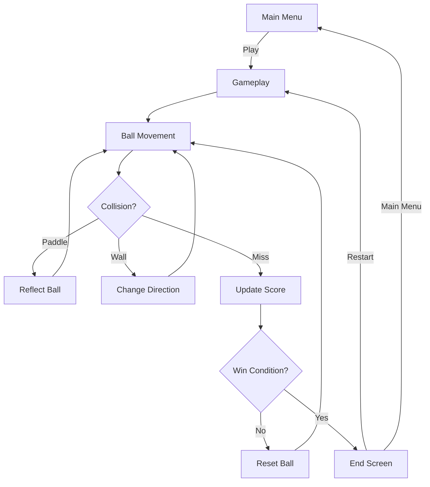
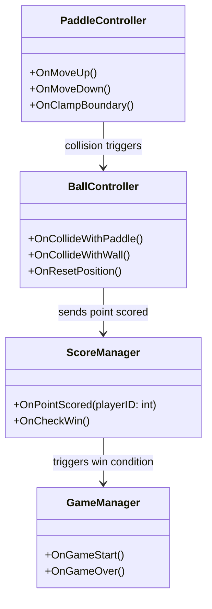

## Developer & Contributions

NichoAndianto (Game Developer)
   

## About
Pong 2D [Prototype] is a modern take on the classic arcade game where two players control paddles to bounce a ball back and forth. The project was built to practice fundamental mechanics such as collision detection, scoring systems, and responsive player controls. My contributions include designing the gameplay loop, implementing paddle and ball physics, and creating a smooth two-player experience.

 

## Key Features

1. Two-Player Gameplay: Local multiplayer mode with responsive paddle controls.

2. Collision Physics: Ball reacts dynamically to paddle angles and boundaries.

3. Scoring System: Real-time score updates with win condition checks.

 

## Scene Flow 

## Layer / module Design 

## Modules and Features.
| 📂 Name              | 🎬 Scene       | 📋 Responsibility                                                                                            |
| -------------------- | -------------- | ------------------------------------------------------------------------------------------------------------- |
| **MainMenu**         | **Main Menu**  | - Display main menu UI - Start gameplay when "Play" is pressed - Exit game when selected              |
| **PaddleController** | **Gameplay**   | - Handle player inputs (Up/Down or W/S) - Clamp paddle movement within boundaries                         |
| **BallController**   | **Gameplay**   | - Move ball with velocity and direction - Detect paddle/edge collisions - Reset ball on scoring event |
| **ScoreManager**     | **Gameplay**   | - Track and display both players’ scores - Declare winner when score limit reached                        |
| **GameOver**         | **End Screen** | - Show winner information - Restart or return to main menu                                                |

 

## Game Flow Chart

 

## Event Signal Diagram

